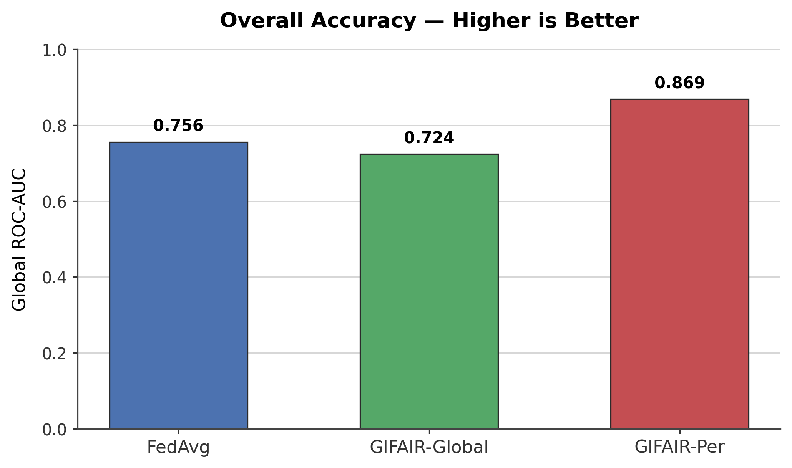
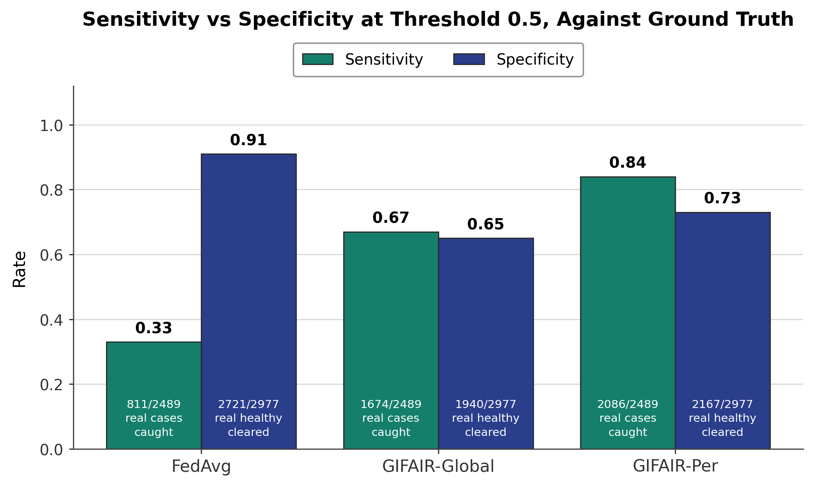
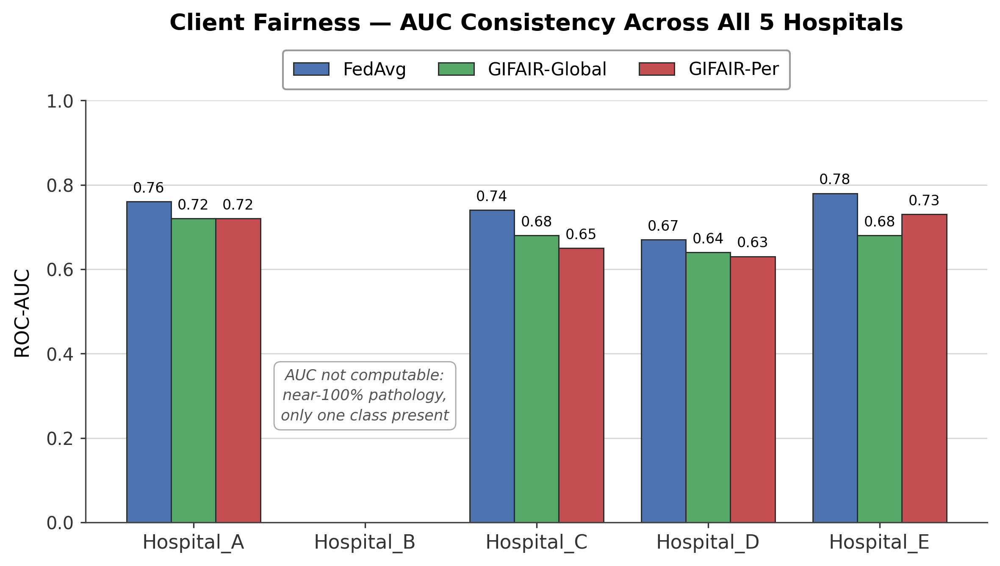
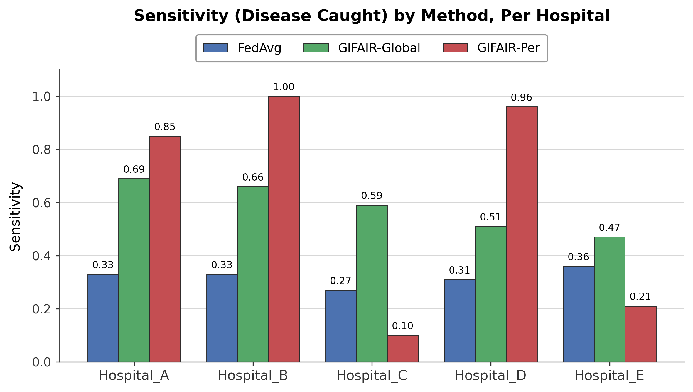
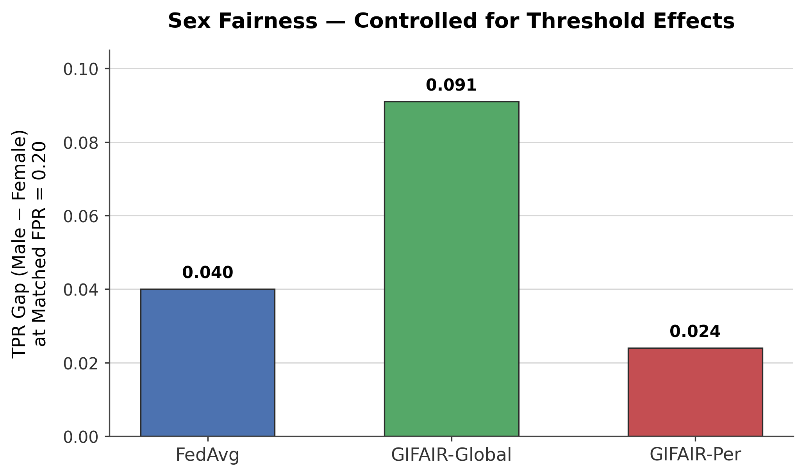
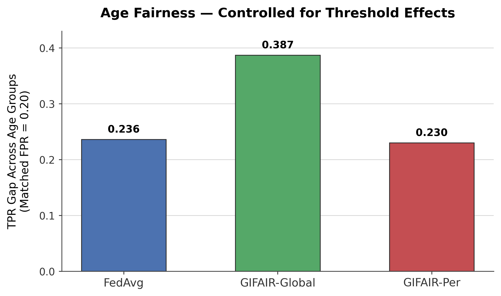
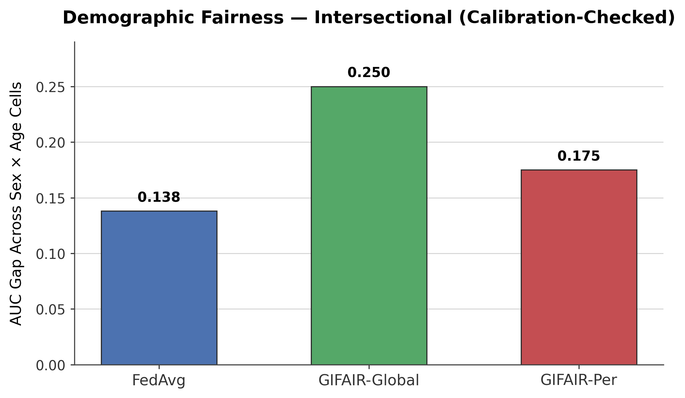

# Federated Learning Aggregation Strategies for Client and Demographic Fairness in Chest X-Ray Classification under Data Imbalance

**Emaduddin Asdaq Syed Mohammed**
MSc Data Science and AI, School of Computing, Newcastle University
Academic year 2025/2026

This repository contains the full implementation, experiments, and evaluation
pipeline for a dissertation comparing five federated learning aggregation
strategies on the NIH ChestX-ray14 dataset, evaluating both inter-client and
demographic fairness simultaneously.

---

## Abstract

Federated learning enables hospitals to collaboratively train diagnostic
models without sharing patient data, but standard aggregation can favour
institutions with larger datasets and leave demographic disparities
unaddressed. This study evaluates five federated aggregation strategies —
FedAvg, q-FedAvg, Ada-IFFL, GIFAIR-Global, and GIFAIR-Per — on the NIH
ChestX-ray14 dataset (112,120 images; 112,104 analysed after exclusion,
across five simulated hospital clients), assessing inter-client and
demographic fairness under Dirichlet-partitioned non-IID heterogeneity
(α = 0.5).

Only three methods converged to a discriminative classifier (global
AUC > 0.55); q-FedAvg and Ada-IFFL failed to learn. Both GIFAIR variants
proved promising, sharing the same regularisation mechanism but differing
in whether it is applied globally or personalised per client — a
distinction that shifts which fairness dimension each excels at.
GIFAIR-Global achieved the lowest inter-client AUC variance (0.0008),
GIFAIR-Per achieved the highest accuracy (AUC 0.869) and the smallest
sex-fairness gap (0.024 at a matched 20% false-positive rate), and FedAvg,
despite no fairness mechanism, achieved the smallest age (0.236) and
intersectional (0.138) fairness gaps.

Naive, fixed-threshold fairness metrics were found to disagree with
threshold-independent checks, and an unenforced stability bound in a
published algorithm's implementation was identified and corrected,
improving one method's accuracy from 0.703 to 0.724. These findings
indicate that aggregation strategy selection in federated healthcare
should be guided by which fairness dimension a deployment prioritises,
verified using threshold-independent metrics rather than a single
reported figure.

---

## 1. Introduction

Federated learning is a distributed machine learning approach that allows
multiple institutions to collaboratively train a shared model without
exposing raw data, maintaining patient privacy and addressing regulatory
constraints that restrict the transfer of sensitive information. While
federated learning addresses data privacy, the aggregation of model
weights across hospitals with varying data sizes introduces fairness
challenges: institutions with larger datasets disproportionately
influence the global model, and this concern intensifies when deploying
diagnostic AI, where fairness across patient populations is critical.

Two distinct fairness challenges emerge when deploying collaborative
models across clinical settings. The first is **inter-client fairness**:
ensuring consistent model performance across hospital clients with
varying data size and distributions. The second is **demographic
fairness**: equitable performance across patients' subgroups, such as sex
and age, within each hospital. This raises the research question: *which
federated learning aggregation strategy best reduces inter-client AUC
variance across simulated hospitals while simultaneously minimising
intra-client demographic fairness gaps, measured using calibration-robust
metrics, across patient age and sex subgroups?* This combination has not
been addressed in existing federated medical imaging literature.

**Aim.** To determine whether federated aggregation strategies can
achieve inter-client and demographic fairness simultaneously, without
relying on naive, threshold-dependent metrics.

**Objectives.**
1. Compare five aggregation strategies under identical non-IID conditions.
2. Identify which strategies converge to a working classifier.
3. Evaluate fairness using both naive and calibration-robust metrics.
4. Identify and correct implementation deviations that could confound
   the comparison.

This study empirically compares FedAvg, q-FedAvg, Ada-IFFL, GIFAIR-Global,
and GIFAIR-Per, evaluating both inter-client and demographic fairness
dimensions simultaneously. These strategies are implemented on the NIH
ChestX-ray14 dataset, an open-access, multi-institution chest X-ray
dataset comprising 112,120 images across 14 disease labels, accessed via
Kaggle. The dataset is partitioned across five simulated hospital clients
using Dirichlet label skew, consistent with genuine cross-institutional
prevalence differences observed in real hospitals.

---

## 2. Methodology

All five methods share an identical experimental foundation, so that
differences in outcome can be attributed to the aggregation strategy
alone.

| Component | Configuration |
|---|---|
| Model | ResNet-18, pretrained on ImageNet, single-unit binary output |
| Task | Binary classification — pathology present vs. no finding |
| Framework | Flower (`flwr`), simulated federated learning |
| Clients | 5 simulated hospitals (Hospital_A–E) |
| Partitioning | Dirichlet label skew, α = 0.5, seed = 42 |
| Split | 85 / 10 / 5 (train / val / test), patient-disjoint |
| Rounds | 10 communication rounds, 3 local epochs per round |
| Batch size | 512 |
| Optimiser | Adam |

**Five aggregation strategies were compared:**

| Method | Mechanism |
|---|---|
| FedAvg (McMahan et al., 2017) | Size-weighted average of client updates; no fairness mechanism |
| q-FedAvg (Li et al., 2020) | Reweights updates by client loss raised to the power *q* |
| Ada-IFFL (Cong et al., 2023) | Computes the fairness exponent *q* adaptively, per client, per round |
| GIFAIR-Global (Yue et al., 2022, Algorithm 2) | Gradient scaling by relative loss rank, shared global model |
| GIFAIR-Per (Yue et al., 2022, Algorithm 3) | Same mechanism as GIFAIR-Global, but personalised per hospital |

A global validity gate (ROC-AUC > 0.55) was applied before any method was
considered eligible for a "best performing" designation on any fairness
criterion, preventing a collapsed classifier's trivially small fairness
gap from being misread as genuine fairness.

Fairness was assessed at five levels of granularity — global, per-client
(inter-hospital), per-sex, per-age-group, and intersectional (sex × age)
— using both fixed-threshold metrics and threshold-independent /
matched-threshold checks, following Hardt, Price & Srebro (2016) for
Equal Opportunity Difference.

---

## 3. Results

| Metric | FedAvg | GIFAIR-Global | GIFAIR-Per |
|---|---|---|---|
| Global ROC-AUC | 0.756 | 0.724 | **0.869** |
| Client fairness (AUC variance) | 0.0018 | **0.0008** | 0.0020 |
| Sex fairness gap (matched threshold) | 0.040 | 0.091 | **0.024** |
| Age fairness gap (matched threshold) | **0.236** | 0.387 | 0.230 |
| Intersectional fairness gap (AUC) | **0.138** | 0.250 | 0.175 |

q-FedAvg (AUC 0.457) and Ada-IFFL (AUC 0.454) did not converge to a
discriminative classifier under this non-IID setting and were excluded
from the fairness comparison.

No single method dominates across every criterion. GIFAIR-Global offers
the most consistent performance across hospitals; GIFAIR-Per achieves the
highest raw accuracy and the strongest sex fairness; FedAvg, despite
incorporating no fairness mechanism at all, achieves the strongest age
and intersectional fairness. A full discussion of these trade-offs,
including the mechanism underlying GIFAIR's client- versus
demographic-level regularisation and the implementation correction
applied to both GIFAIR variants, is provided in Sections 5 and 6 of the
accompanying dissertation.

### Figures

<p align="center">
  
</p>

**Figure 1.** Overall discriminative performance of each aggregation
strategy, measured as global ROC-AUC on the pooled test set. Higher
values indicate better ranking of positive against negative cases.

<p align="center">
  
</p>

**Figure 2.** Sensitivity and specificity of each aggregation strategy at
a fixed decision threshold of 0.5, evaluated against ground-truth labels.
Counts inside each bar give the number of cases correctly identified out
of the total in that class.

<p align="center">
  
</p>

**Figure 3.** Client-level fairness, expressed as per-hospital ROC-AUC
for each aggregation strategy. A flatter profile across Hospital_A to
Hospital_E indicates more uniform performance across participating
clients. No values are reported for Hospital_B: its test partition is
almost entirely pathological, so only one class is present and ROC-AUC
is not computable.

<p align="center">
  
</p>

**Figure 4.** Per-hospital sensitivity (proportion of true disease cases
detected) for each aggregation strategy, showing how detection
performance varies across clients under non-IID data partitioning.

<p align="center">
  
</p>

**Figure 5.** Sex fairness, measured as the true-positive-rate gap
between male and female patients at a matched false-positive rate of
0.20. Matching the operating point removes the confounding effect of
differing decision thresholds; smaller gaps indicate more equitable
detection.

<p align="center">
  
</p>

**Figure 6.** Age fairness, measured as the true-positive-rate gap across
age groups at a matched false-positive rate of 0.20. Smaller gaps
indicate more equitable detection across age strata.

<p align="center">
  
</p>

**Figure 7.** Intersectional demographic fairness, measured as the
ROC-AUC gap across sex × age subgroup cells after calibration checking.
Smaller gaps indicate more consistent performance across intersecting
demographic groups.

---

## 4. Repository Structure

```
federated-learning-fairness-xray/
├── README.md
├── notebooks/
│   ├── 00_dataset_freezing.ipynb    — generates the frozen, patient-disjoint data split
│   ├── 01_fedavg.ipynb              — FedAvg (McMahan et al., 2017)
│   ├── 02_qfedavg.ipynb             — q-FedAvg (Li et al., 2020)
│   ├── 03_adaiffl.ipynb             — Ada-IFFL (Cong et al., 2023)
│   ├── 04_gifair_global.ipynb       — GIFAIR-Global (Yue et al., 2022, Algorithm 2)
│   ├── 05_gifair_per.ipynb          — GIFAIR-Per (Yue et al., 2022, Algorithm 3)
│   └── 06_evaluation.ipynb          — cross-method fairness evaluation and final ranking
├── figures/                         — result figures referenced in Section 3, above
│   ├── fig1_overall_auc.png
│   ├── fig2_sens_spec.png
│   ├── fig3_client_fairness.png
│   ├── fig4_sensitivity_per_hospital.png
│   ├── fig5_sex_fairness.png
│   ├── fig6_age_fairness.png
│   └── fig7_intersectional.png
└── dissertation/
    ├── splits/                      — 15 CSVs: the frozen train/val/test partition
    │   ├── Hospital_A_train.csv
    │   ├── Hospital_A_val.csv
    │   ├── Hospital_A_test.csv
    │   └── ...                      — (5 hospitals × train/val/test)
    └── results/
        └── evaluate/                — all evaluation outputs: summary tables,
                                        ranking CSVs, and figures (PNG)
            ├── final_ranking_frozen_split.csv
            ├── summary_global_all_methods_frozen_split.csv
            └── *.png
```

Trained model weights and full per-method result files are not tracked
in this repository due to size, but are available at the link below.

**Model weights and full results:**
[Google Drive — `dissertation/results/`](https://drive.google.com/drive/folders/1KXGkU9abgU5q21nz141mVAtutNFY7BIV?usp=sharing)
(public, view-only)

---

## 5. Reproducing This Work

1. Run `notebooks/00_dataset_freezing.ipynb` once. This downloads NIH
   ChestX-ray14 from Kaggle, applies the Dirichlet partition, and writes
   the 15 frozen split CSVs to `dissertation/splits/`.
2. Run each of `01_fedavg.ipynb` through `05_gifair_per.ipynb`
   independently, in any order. Each notebook loads the frozen splits
   from step 1, trains its respective aggregation strategy for 10
   communication rounds, and saves its trained model weights and metrics
   to `dissertation/results/`.
3. Run `06_evaluation.ipynb` last. This loads every saved model, performs
   inference once per method per hospital on the held-out test sets, and
   produces every summary table and figure reported in the dissertation,
   saved to `dissertation/results/evaluate/`.

All notebooks were developed and run on Google Colab with GPU acceleration.
A Kaggle API credential (`kaggle.json`) is required for dataset access.

---

## 6. Limitations

Some method-specific parameters (notably q-FedAvg's scaling constant *L*)
were adapted where published defaults proved unworkable on this dataset;
none were systematically tuned, so reported results likely represent a
lower bound on each method's achievable performance. Results rest on a
single random seed and one dataset partition. A full discussion of
limitations and directions for future work is provided in Section 6 of
the dissertation.

---

## Citation

If referencing this work, please cite:

> Emaduddin Asdaq Syed Mohammed (2026). *Federated Learning Aggregation
> Strategies for Client and Demographic Fairness in Chest X-Ray
> Classification under Data Imbalance*. MSc Dissertation, School of
> Computing, Newcastle University.

**Supervision:** Dr Jichun Li (School of Computing, Newcastle University)

**Dataset:** NIH ChestX-ray14 (Wang et al., 2017), accessed via
[Kaggle](https://www.kaggle.com/datasets/nih-chest-xrays/data)
